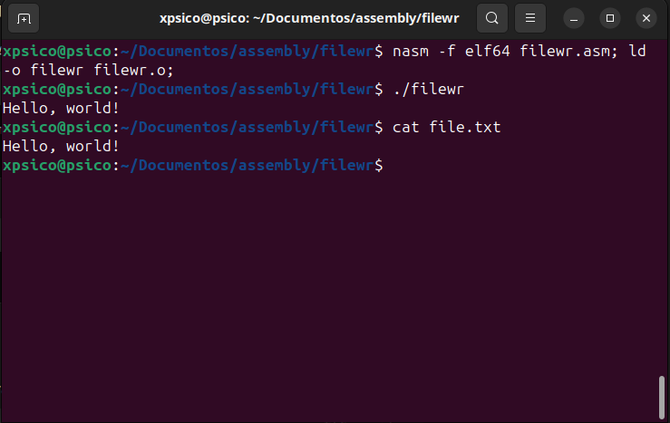

# Simple File Operations in Assembly

Programa simples em assembly no qual este abre um arquivo (se nao existir, cria um) chamado file.txt, escreve "Hello, world!" e logo após exibe o que foi escrito na saída do terminal.

# Sobre o projeto

Desenvolvi este programa para praticar operações de E/S (entrada e saída) em Assembly, utilizando chamadas de sistema no Linux.

# Requisitos

- [NASM](https://www.nasm.us/)
- Linker `ld`
- Sistema Linux (x86_64)

# Montagem e execução

1. Compile o programa com o NASM e linke usando `ld`:
    ```bash
    nasm -f elf64 filewr.asm; ld -o filewr filewr.o;
    ```

2. Execute o programa:
    ```bash
    ./filewr
    ```

# Saída esperada

Após a execução:

